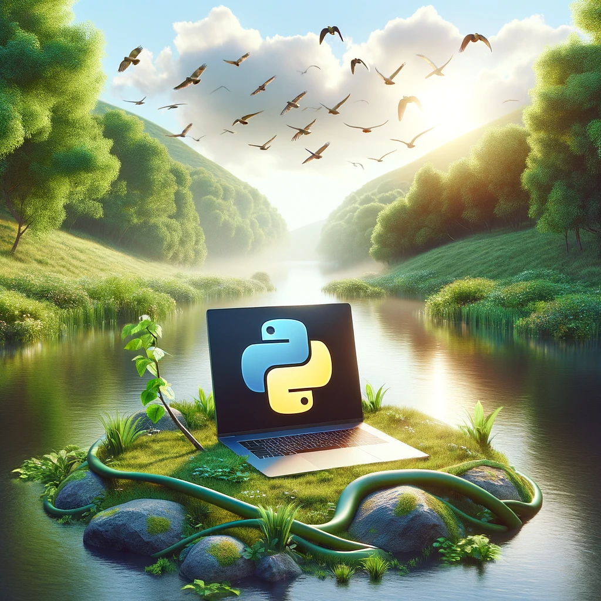

  

# Learn-Python-Programming-Language

Welcome to the *Learn Python Programming Language* repository! Python is not only one of the most popular programming languages worldwide but also known for its simplicity and versatility. This repository is designed to help you embark on your Python learning journey, offering resources and tutorials that are updated weekly. Let's dive into why learning Python is a valuable endeavor and where it can be applied.

## Why Learn Python?

- **Ease of Learning:** Python's syntax is clear and intuitive, making it an excellent language for beginners in the world of programming.
- **Versatility:** From web development to data science, Python is used across a wide range of fields, making your skills highly transferable.
- **Strong Community Support:** With one of the largest programming communities, Python provides an abundance of resources, libraries, and frameworks to support your learning and project development.
- **Career Opportunities:** Python skills are in high demand in areas such as data analysis, machine learning, artificial intelligence, and backend web development.

## Applications of Python

- **Web Development:** Frameworks like Django and Flask make it easy to build robust web applications.
- **Data Science and Analysis:** Python's powerful libraries like NumPy, Pandas, and Matplotlib facilitate data manipulation, analysis, and visualization.
- **Machine Learning and Artificial Intelligence:** Libraries such as TensorFlow and Scikit-learn enable the development of advanced ML models and AI applications.
- **Automation and Scripting:** Python can automate repetitive tasks and processes, increasing efficiency.
- **Game Development:** With libraries like Pygame, Python is also used for developing simple video games.

## Getting Started

Dive into Python with our weekly updated tutorials and resources. Whether you're starting from scratch or looking to advance your skills, this repository is your gateway to mastering Python. Enjoy your learning journey, and remember, the Python community is here to support you every step of the way. If there is a part of the code that you do not understand and the comment lines do not help you understand enough, you can copy your code to ChatGPT and ask for explanation or directly ask to me.

Happy coding!

**Notice:** To access weekly codes, go to the code of the week you want and click on the **Open in Colab** button at the top. 

**Source :** [Ali Osman ÇIBIKDİKEN](https://github.com/aocdiken)

